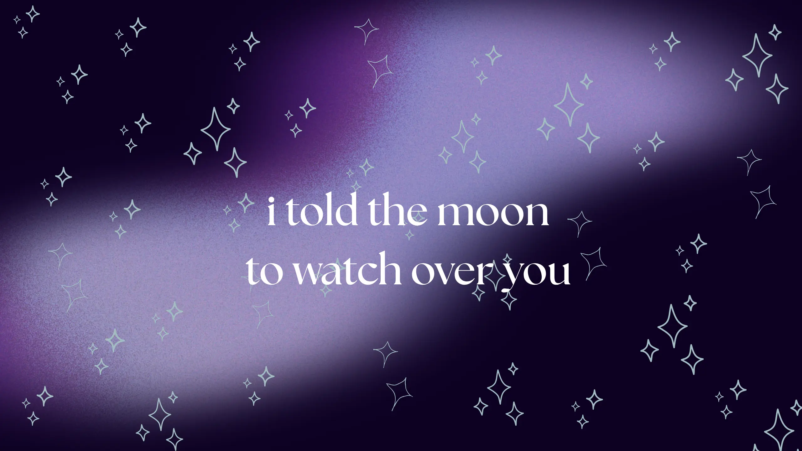

  

## Hi there 👋

I'm a 20 y.0. currently working as a software developer for a local company. My main focus is building <b>actually useful systems</b> that solve real practical problems, while providing the <b>best UX</b> it can give.

I'm deeply passionate about design, efficiency, fitness and books. 

I'm open for part-time/commission work, especially for open-source projects!

 

### Stack 💻
- - -

Especially proficient in web technologies, I work with <b>PHP, React, MySQL, PostgreSQL, Python</b>.

I code in <b>Java, C, C#</b>

I'm also interested in <b>Cybersecurity, GameDev</b>

 

### More of me 🔎 
- - - 

<a href="https://andreabocci.it/blog">Check out my blog!</a>

<a href="https://zsharpfire.itch.io/">Check out my LD games!</a>  (made in a few days)

